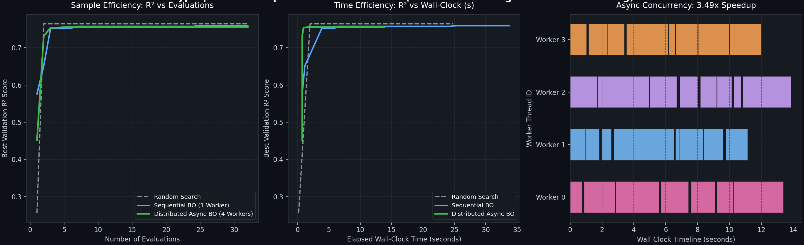
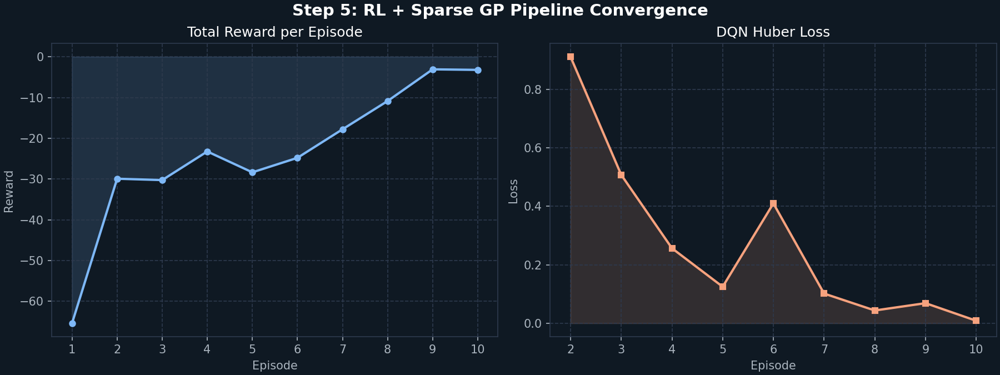
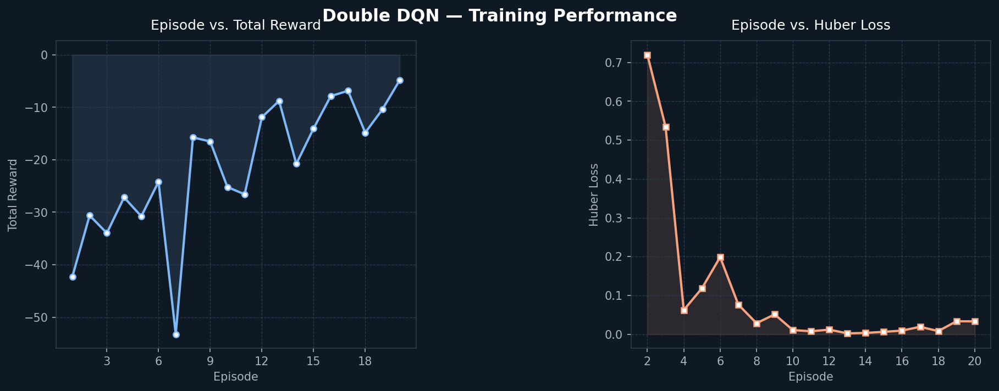

<div align="center">

# Distributed Bayesian Optimization Framework
### Advanced Stochastic Processes, Variational Inference & Reinforcement Learning

[](https://www.python.org/downloads/)
[](https://pytorch.org/)
[]()
[](https://opensource.org/licenses/MIT)

*A research-grade Bayesian optimization engine implemented from first principles in pure PyTorch (`float64`) — no GPyTorch, BoTorch, or scikit-learn GP abstractions. Built from scratch with exact Cholesky linear algebra, scalable variational sparse models, an asynchronous multi-worker distributed loop, and a continuous Double DQN decision pipeline.*

</div>

---

## Key Highlights & Benchmark Results

- **Asynchronous Distributed Optimization (Step 5)**: Eliminates synchronous batch bottlenecks with an asynchronous master-worker coordinator and Parallel Thompson Sampling. In real-world machine learning HPO (Gradient Boosting on California Housing), 4 parallel workers achieved a **3.49x wall-clock speedup** with **87.2% worker efficiency**, cutting optimization time from 48.5s to **13.9s**.
- **Sparse GP Scalability (Step 3)**: Implements Titsias (2009) collapsed VFE bound and Hensman et al. (2013) Stochastic Variational Inference (SVI). Scales to $N = 20,000$ points in **~6.35s** on a standard CPU with $O(nm^2)$ complexity.
- **Continuous RL Decision Pipeline (Step 4)**: Augments the state space with GP posterior mean and variance, allowing a Double DQN agent with Huber loss and target network sync to learn optimal exploration/exploitation policies over noisy continuous search spaces.
- **Rigorous Mathematical Invariants**: 70 comprehensive unit tests verify positive semi-definiteness, noise-free interpolation, prior reversion, Monte-Carlo moment convergence, and numerical jitter escalation.

<div align="center">
  
  <p><i>Figure 1: Real-world HPO Benchmark comparing Random Search, Sequential BO, and Distributed Asynchronous BO (4 Workers) with Concurrency Gantt Chart.</i></p>
</div>

---

## Architecture Overview

```mermaid
flowchart TD
    subgraph Master ["Asynchronous Master Coordinator"]
        A[Surrogate Model - Exact / Sparse GP] --> B[Parallel Thompson Sampling / EI / UCB]
        B --> C[Asynchronous Dispatcher]
        G[Observation Ingestion & Online Refit] --> A
    end

    subgraph Workers ["Parallel Worker Pool (Threads / Processes)"]
        C --> D1[Worker 1: Eval f(x1)]
        C --> D2[Worker 2: Eval f(x2)]
        C --> D3[Worker 3: Eval f(x3)]
        C --> D4[Worker 4: Eval f(x4)]
    end

    D1 -->|Finish: x1, y1| G
    D2 -->|Finish: x2, y2| G
    D3 -->|Finish: x3, y3| G
    D4 -->|Finish: x4, y4| G
```

The framework is composed of 5 distinct mathematical layers:

1. **Exact GPR ([src/gp_regression.py](src/gp_regression.py))**: RBF/ARD kernel, Cholesky-based posterior mean and covariance, differentiable log marginal likelihood, and type-II ML hyperparameter optimization with Adam.
2. **Acquisition & Stochastic Sampling ([src/acquisition.py](src/acquisition.py), [src/sampling.py](src/sampling.py))**: Expected Improvement with exact closed-form analytical gradients, GP-UCB with dynamic Srinivas $\beta_t$ schedule, Thompson sampling, Metropolis-Hastings MCMC, and Langevin dynamics (Euler-Maruyama & MALA).
3. **Scalable Sparse GP ([src/sparse_gp.py](src/sparse_gp.py))**: Inducing point formulation via Titsias VFE and Hensman SVI with learnable inducing locations $Z$.
4. **Reinforcement Learning Pipeline ([src/environment.py](src/environment.py), [src/rl_agent.py](src/rl_agent.py))**: Continuous noisy environment paired with a Double DQN agent operating in float64 with replay buffer and Huber loss.
5. **Asynchronous Distributed Engine ([src/distributed.py](src/distributed.py))**: Non-blocking master-worker coordinator with Parallel Thompson Sampling to distribute evaluations across concurrent workers without straggler latency.

---

## Project Structure

```text
distributed-bayes-opt/
├── benchmarks/              # Real-world ML hyperparameter optimization benchmarks
│   ├── run_hpo_benchmark.py # Head-to-head comparison: Random vs Sequential vs Distributed
│   └── hpo_benchmark_results.png
├── config/                  # Configuration files
│   └── gp_config.yaml       # Default GP, MCMC, and SVI hyperparameters
├── src/                     # Core framework library
│   ├── gp_regression.py     # Exact Gaussian Process Regression from scratch
│   ├── acquisition.py       # Analytical EI, UCB (dynamic beta), Thompson Sampling
│   ├── sampling.py          # Vectorized MCMC & Langevin dynamics (MALA)
│   ├── sparse_gp.py         # Variational Sparse GP (Titsias VFE & Hensman SVI)
│   ├── environment.py       # Continuous stochastic BO environment
│   ├── rl_agent.py          # Double DQN agent with replay buffer (float64)
│   └── distributed.py       # Asynchronous Master-Worker distributed engine
├── tests/                   # Comprehensive unit test suite (70 tests)
│   ├── test_gp_regression.py
│   ├── test_sampling_acquisition.py
│   ├── test_sparse_gp.py
│   ├── test_rl_integration.py
│   └── test_distributed.py
├── main.py                  # Standalone Double DQN training demo (Step 4)
├── run_pipeline.py          # Integrated Sparse GP + Double DQN loop (Step 5)
└── pyproject.toml           # Project metadata and dependencies
```

---

## Installation

```bash
# Clone the repository
git clone https://github.com/shayansalehi1381/distributed-bayes-opt.git
cd distributed-bayes-opt

# Install dependencies in editable mode
pip install -e ".[dev]"
```

---

## How to Run

### 1. Real-World Machine Learning Benchmark (Distributed vs Baseline)
Runs a head-to-head HPO comparison on the California Housing dataset using 4 concurrent workers:
```bash
python benchmarks/run_hpo_benchmark.py
```

### 2. Full Integrated Pipeline (Sparse GP + Double DQN)
Runs the real-time loop where the RL agent explores the continuous space while the Sparse GP surrogate updates online:
```bash
python run_pipeline.py
```

### 3. Standalone Double DQN Exploration Demo
Runs a 20-episode demonstration of the continuous stochastic environment with linear $\varepsilon$-decay:
```bash
python main.py
```

### 4. Running the Test Suite
Executes all 70 unit and integration tests:
```bash
pytest -v
```

---

## Quick Start Code Examples

### 1. Asynchronous Distributed Optimization (Step 5)

```python
import torch
from src.distributed import AsyncBayesOptCoordinator, DistributedConfig

# Define an expensive black-box objective function
def expensive_objective(x: torch.Tensor) -> float:
    return float(-(x[0]**2 + x[1]**2))

# Configure 4 concurrent asynchronous workers
cfg = DistributedConfig(
    dim=2,
    n_workers=4,
    total_evaluations=32,
    surrogate="exact",  # or "sparse"
)

coordinator = AsyncBayesOptCoordinator(expensive_objective, cfg)
result = coordinator.optimize()

print(f"Global Optimum Found: {result.best_y:.5f} at x = {result.best_x}")
print(f"Parallel Wall-Clock Speedup: {result.speedup_ratio:.2f}x")
```

### 2. Bayesian Optimization Primitives (Step 1 & 2)

```python
import torch
from src.gp_regression import GaussianProcessRegressor
from src.acquisition import ExpectedImprovement

x = torch.rand(50, 2, dtype=torch.float64) * 4 - 2
y = torch.sin(2 * x[:, 0]) + 0.5 * torch.cos(3 * x[:, 1])

gp = GaussianProcessRegressor()
gp.optimize_hyperparameters(x, y, n_iters=200)

candidates = torch.rand(512, 2, dtype=torch.float64) * 4 - 2
ei = ExpectedImprovement(gp)
best_candidate = candidates[ei(candidates).argmax()]
```

### 3. Scalable Sparse GP with Inducing Points (Step 3)

```python
import torch
from src.sparse_gp import SparseGPRegressor, greedy_inducing_init

# Initialize inducing points via greedy farthest-point selection
x_train = torch.rand(5000, 2, dtype=torch.float64)
y_train = torch.sin(x_train[:, 0]) + torch.cos(x_train[:, 1])

z = greedy_inducing_init(x_train, m=32)
sgp = SparseGPRegressor(inducing_points=z, learn_inducing=True)
sgp.fit_svi(x_train, y_train, n_epochs=30, batch_size=256)
```

---

## Visual Convergence Figures

<div align="center">
  
  
  <p><i>Left: Sparse GP + RL Integrated Convergence. Right: Double DQN Episode Reward & Huber Loss.</i></p>
</div>

---

## Mathematical Foundations

Given noisy observations $(X, \mathbf{y})$ with $y = f(x) + \varepsilon$, where $\varepsilon \sim \mathcal{N}(0, \sigma_n^2)$ and an RBF/ARD covariance kernel:

$$k(x, x') = \sigma_f^2 \exp\left(-\frac{1}{2}\sum_{d=1}^D \frac{(x_d - x'_d)^2}{\ell_d^2}\right)$$

Inference uses a single Cholesky decomposition $K + \sigma_n^2 I = L L^\top$ with adaptive jitter:

$$\boldsymbol{\mu}_* = K_*^\top (LL^\top)^{-1} \mathbf{y}, \qquad \boldsymbol{\Sigma}_* = K_{**} - K_*^\top (LL^\top)^{-1} K_*$$

The marginal likelihood is maximized directly via autograd:

$$\log p(\mathbf{y} \mid X) = -\frac{1}{2} \mathbf{y}^\top (K + \sigma_n^2 I)^{-1} \mathbf{y} - \sum_{i} \log L_{ii} - \frac{N}{2}\log(2\pi)$$

---

## License

This project is licensed under the MIT License — see the [LICENSE](LICENSE) file for details.
